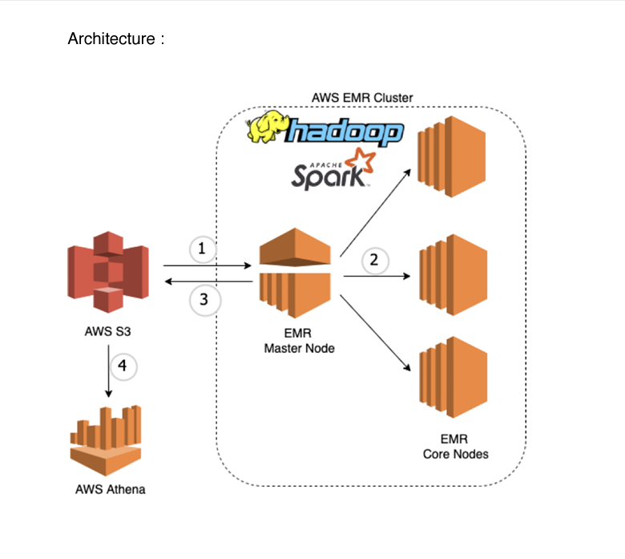

# Batch Processing of Wikipedia Data using AWS EMR & PySpark

## Project Overview

This project demonstrates how to perform batch processing on Wikipedia data using Amazon Web Services (AWS). The project leverages **Amazon S3** for storage, **Amazon EMR** for processing, and **Amazon Athena** for querying the processed results. 

### Business Context

In a professional data engineering career, it is common to encounter scenarios where data is collected daily. Batch processing allows for efficient analysis of this data. This project focuses on processing a day's worth of Wikipedia data to derive insights and take appropriate actions based on these insights.

## Data Pipeline

The data pipeline consists of the following steps:

1. **Data Storage**: Sample data is stored in an S3 bucket.
2. **Processing**: PySpark code runs on an EMR cluster to:
   - Fetch data from the S3 bucket.
   - Perform filtering and aggregation.
   - Store the processed data back into S3 in a different folder.
3. **Querying**: Use Athena to query the processed data in S3 by creating a table with the relevant schema and executing ANSI SQL queries.


## Architecture




## Technologies Used

- **Languages**: Python
- **Package**: PySpark
- **AWS Services**:
  - **Amazon S3**: Scalable object storage for data.
  - **Amazon EMR**: Big data processing service using a Hadoop cluster.
  - **Amazon Athena**: Interactive query service that uses SQL to query data in S3.

## Getting Started

To replicate this project, follow the steps below:

1. **Setup AWS Account**: Ensure you have an AWS account with access to S3, EMR, and Athena services.
2. **Create an S3 Bucket**: Create a bucket in S3 and upload your sample Wikipedia data.
3. **Launch an EMR Cluster**:
   - Select the appropriate instance type and number of instances based on your data volume.
   - Install the necessary applications (e.g., Spark).
4. **Run PySpark Code**:
   - Write and upload your PySpark script to the EMR cluster.
   - Execute the script to process the data.
5. **Query Processed Data with Athena**:
   - Create a new table in Athena pointing to the processed data in S3.
   - Use SQL queries to analyze the data.

## Example PySpark Code

Here is a snippet of the PySpark code used for processing:

```python
from pyspark.sql import SparkSession

# Initialize Spark session
spark = SparkSession.builder.appName("WikipediaDataProcessing").getOrCreate()

# Load data from S3
data = spark.read.json("s3://your-bucket-name/input-data/")

# Perform filtering and aggregation
filtered_data = data.filter(data['column_name'] == 'some_value')
aggregated_data = filtered_data.groupBy('another_column').count()

# Write processed data back to S3
aggregated_data.write.mode("overwrite").json("s3://your-bucket-name/processed-data/")

spark.stop()
